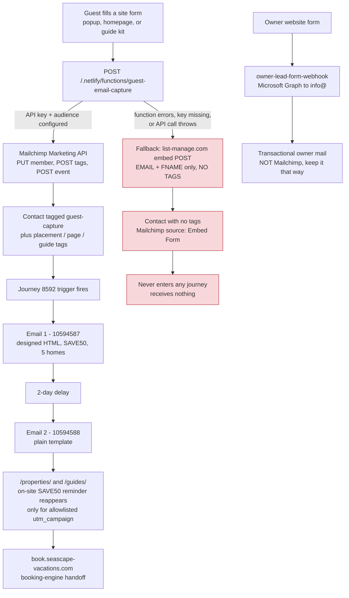

# Email And Marketing Ultrasound - 2026-08-20

## Verdict

The guest email machine is built and running, but roughly a quarter of the list
never enters it, and the half that does gets a designed first email followed by
a plain-text second one. Nothing here needs to be rebuilt. Four specific things
need to be repaired, in order, and only one of them requires a send.

The single biggest hole: a site signup that misses the tagging step still shows
the visitor a success screen, still returns HTTP 200, and still lands in the
Mailchimp audience - but with no `guest-capture` tag, so it never enters the
welcome journey and never receives any email at all. That failure is silent.

Second biggest: nothing is measurable. The audience has zero segments, and the
welcome email's property links were sent without UTMs, so there is no way to
prove any of this produces a direct booking.

## Sources Used

- Live Mailchimp UI audit, us6 account, read 2026-08-20. No live stats were
  recreated or estimated in this document.
- Repo source read on branch `cursor/email-marketing-ultrasound-81e2`.
- `seascape-hub` could not be read from this agent's GitHub token (private repo,
  403). The Mailchimp / Outlook sender split from Hub PR #592 is taken as given
  from the founder brief, not verified against Hub canon.

## The Machine, End To End



Source files behind each step:

| Step | File |
|---|---|
| Popup on 44 guide pages | `src/_includes/partials/email-popup.njk` |
| Homepage popup (its own copy of the markup, not the partial) | `src/index.njk` |
| Inline guide form | `src/_includes/partials/guide-conversion-kit.njk` |
| Submit + fallback logic | `src/assets/js/conversion-tracking.js` (`submitInlineEmailForm`) |
| Tagging, events, receipts | `netlify/functions/guest-email-capture.js`, `netlify/functions/_guest-email-capture-metrics.js` |
| Landing-page SAVE50 reminder | `src/_includes/partials/save50-offer.njk` |
| Email 1 artifact | `docs/outreach/templates/save50-welcome-email.html` / `.txt` |
| Email 2 artifact (new) | `docs/outreach/templates/save50-house-fit-email.html` / `.txt` |
| Owner lane (separate) | `netlify/functions/owner-lead-form-webhook.js`, `_owner-lead-delivery.js`, `_owner-lead-mail.js` |

## Live Versus Dead

| Piece | State | Note |
|---|---|---|
| Site capture to Mailchimp API, with tags | live | This is the only path that reaches the journey |
| Embed-form fallback path | live, and harmful | Creates untagged contacts that receive nothing |
| Journey 8592 "Welcome new contacts" | live, active since May 26 | Trigger is the `guest-capture` tag, re-entry off |
| Email 1 (10594587) | live, designed | 19.0% opens, 0.40% clicks, 5.6% bounce |
| Email 2 (10594588) | live, plain template | Subject and links repaired 2026-08-20; the 244 already-completed contacts keep the old 0%-click version |
| Journey 8590 | gone | No action |
| Regular campaigns | never sent | 0 sent, ever |
| Segments | none | 0 segments, so the list cannot be reported on by source |
| Sender identity | live | Seascape Vacations / `info@seascape-vacations.com`, domain authenticated |
| Owner form to `info@` via Graph | live, transactional | One real lead (May 10) went cold; the rest are tests |
| Outlook campaign lane | hard-disabled in source | Stays off. Phase 1 |
| Email 3 in the sequence doc | draft only, never built | Do not build it yet |
| Repo outreach docs' sender story | stale and inverted | See "Docs That Lie" below |

## The Four Defects, In Priority Order

### 1. Untagged signups receive nothing, silently

`submitInlineEmailForm` in `src/assets/js/conversion-tracking.js` posts to the
Netlify function first. If that request fails, it posts the same signup straight
to `https://seascape-vacations.us6.list-manage.com/subscribe/post` with only
`EMAIL` and `FNAME`. That endpoint cannot attach tags.

The function has the same shape internally. `submitToMailchimp` falls back to
the same embed endpoint when `MAILCHIMP_API_KEY`, the server prefix, or the
audience ID is missing (`marketing_api_unconfigured`) or when the API call
throws (`marketing_api_submit_failed`).

Either way the contact lands in the audience with no `guest-capture` tag,
Mailchimp records the source as Embed Form, and Journey 8592 never triggers.

Why it is silent:

- the function returns HTTP 200 with `stored: true`
- the popup shows the "Your SAVE50 Code Is Ready" success panel either way
- the warning is written into the receipt's `mailchimp.warnings` array in the
  Netlify Blobs metrics store, and nothing reads or alerts on it

The live audit shows 373 subscribers against 268 journey entries. Some of that
gap predates the journey's May 26 activation, so 105 is the size of the
"never entered" pool, not a proven fallback count. The receipts in the metrics
store are the place to get the real number: count receipts whose
`mailchimp.mode` is `legacy_form` or whose warnings are non-empty.

### 2. Nothing is measurable

Zero segments exist, so the audience cannot be reported on by capture source,
placement, or guide - even though the function already writes exactly those
tags (`guest-capture-placement-popup`, `guest-capture-page-<slug>`,
`guest-capture-guide-<slug>`, and so on).

Email 1's property links were sent without UTMs. So the traffic that email
produced, if any, is indistinguishable from direct traffic in GA4.

### 3. Email 1 and Email 2 are not the same brand

Email 1 is a designed HTML email: cream background, white rounded card, serif
headings, a photographic hero, a coupon ticket, and a five-home grid. Email 2 is
a plain Mailchimp template - centered black text on white, bulleted links, no
header lockup, no card, no footer identity.

A guest reads them two days apart. The second one reads like a different, smaller
company wrote it, and it arrives at the exact moment the guest is deciding which
house to book. That is the worst possible place to lose credibility.

There is also copy drift in the live Email 2 that the repo templates do not
support:

- "pools, hot tubs, and beach chairs included at every property" is an overclaim.
  In `src/_data/properties-fallback.json`, Sarasota Luxe's `amenities` list is
  `["pool","downtown"]` with no hot tub, and beach chairs appear on individual
  property pages rather than as a verified inclusion across all five.
- "10 minutes from Anna Maria Island" and "be at the beach in 15 minutes" are
  drive-time claims that are not in any repo template. The Oasis page states
  Holmes Beach at 5.4 miles.
- Two guide references render as plain text rather than links. Worth a re-check
  even after the 2026-08-20 link repair.

Repair for this defect ships in this PR - see "What This PR Ships".

### 4. Docs that lie

`docs/outreach/mailchimp-welcome-sequence.md` and
`docs/outreach/mailchimp-guest-social-proof-campaign.md` both describe Mailchimp
as a retired provider with no send authority, and instruct the reader not to
deliver through it. Mailchimp has been the live guest sender since May 26.

The Outlook prohibitions in those docs are still correct and stay. The Mailchimp
framing is wrong and misroutes the next agent. This PR corrects the sender
section of the welcome-sequence doc without touching the Outlook lock.

## Email 1's UTM Gaps, As They Sit In The Repo

Still present, and worth one coordinated fix rather than a drive-by:

1. `docs/outreach/templates/save50-welcome-email.html` and `.txt` put
   `utm_source=outlook` on all eleven Seascape links - every property link, the
   main CTA, and all four footer links. The email is sent by Mailchimp, so that
   traffic would be filed under the wrong channel in GA4.
2. `scripts/enforcement/save50-welcome-email-template.test.js` actively enforces
   that wrong value - `requiredCampaignParams` hardcodes
   `utm_source: "outlook"`. The gate currently locks in the mislabel.
3. The live Email 1 property links had no UTMs at all when audited, so the live
   send and the repo artifact disagree with each other as well as with reality.

Fixing it means changing the source value in four coordinated places: the two
template files, the sequence doc, and the test's `requiredCampaignParams` plus
its "at least 12 landing links" assertion. That is a small, contained change,
but it should land as its own PR alongside the live Email 1 re-paste so the
artifact and the live email agree afterwards.

## The Campaign-Name Constraint Nobody Should Trip Over

`src/_includes/partials/save50-offer.njk` allowlists exactly two campaign
tokens:

From `src/_includes/partials/save50-offer.njk`, lines 96-97:

```js
const SAVE50_CAMPAIGNS = ["save50_welcome", "guest_social_proof"];
const DEFAULT_SAVE50_CAMPAIGN = SAVE50_CAMPAIGNS[0];
```

`src/_includes/partials/email-popup.njk` carries the same two. If an email uses
any other `utm_campaign`, the reader lands on `/properties/` and the on-site
SAVE50 reminder stays hidden - they arrive holding a code the page does not
acknowledge.

So Email 2 reuses `utm_campaign=guest_social_proof`. It is already allowlisted,
already covered by tests, and it keeps Email 1 and Email 2 separable in GA4
without touching live property pages. If the report label needs to read
`save50_house_fit` later, the rename requires editing both partials plus
`scripts/enforcement/save50-offer.test.js` and
`scripts/enforcement/save50-house-fit-email-template.test.js` in one PR.

## One More Thing Worth Knowing About Email 1's Click Rate

The popup already hands over the code. On success it shows "SAVE50" in large
type and a "Browse Properties" button pointed at `/properties/?promo=save50`.

So for a popup signup, Email 1's only unique job is a second click on a page
they were already offered. A 19% open rate with a 0.40% click rate is the
predictable result, not a copy failure. That is the strongest argument for
Email 2 doing a genuinely different job - sorting the five houses - rather than
restating the offer.

Note the guide inline form makes a different promise: "Join The Direct-Booking
List", no code shown, no SAVE50 mentioned. Those subscribers get a SAVE50 email
they were not promised. That is a pleasant surprise rather than a problem, but
it means the two capture surfaces set different expectations for the same
journey.

## What This PR Ships

Paste-ready Email 2, in Email 1's visual system:

- `docs/outreach/templates/save50-house-fit-email.html`
- `docs/outreach/templates/save50-house-fit-email.txt`
- `scripts/enforcement/save50-house-fit-email-template.test.js`

Subject stays `Want help picking the right Seascape home?` - the one the Chief of
Staff already set live and the one this repo's sequence doc already governs.

The job changed. Email 2 no longer restates the offer; it sorts the five houses
by group size and sends the click to a property page or a guide:

| Your group | Start with |
|---|---|
| 13 to 16 guests | The Oasis - the only house that sleeps 16 |
| Up to 12, want a dock | Dockside Dreams - private dock on the water |
| Up to 12, Sarasota side | Sarasota Luxe - downtown, near St. Armands |
| Up to 12, towing a boat | River House - one minute to the boat ramp |
| Up to 10 guests | Bradenton Pool Home - closest house to IMG Academy |

Every fit line traces to `highlights` and `amenities` in
`src/_data/properties-fallback.json`. Kept: SAVE50, the 3-night minimum, all five
named homes, `(941) 704-8545`, and the `*|UNSUB|*` / `*|UPDATE_PROFILE|*` /
`*|ARCHIVE|*` merge tags. Excluded: any expiry date, any review count, any
sitewide hot-tub or beach-chair claim, and the word "heated" - pool heat is a
paid nightly add-on, so "heated pool" is banned by the test rather than claimed.

One deliberate difference from Email 1: Email 2 opens on a compact deep-teal band
with the same gold eyebrow and serif headline rather than repeating Email 1's
photographic hero. Three reasons. The reader saw that photo two days earlier; a
335px hero pushes the group-size table below the fold in an email whose only job
is a click; and the hosted hero is 1200x670, so any band that is not the same
1.791 ratio gets stretched by Outlook, which ignores `object-fit` and scales VML
backgrounds to fill. Everything else - palette, header lockup, card treatment,
coupon ticket, footer - is Email 1's system.

Property card images render at 215x130, matching the 560x340 source ratio, for
the same reason. An enforcement check now reads the actual pixel dimensions of
each hosted asset and fails if any image is declared at a ratio more than 2% off
its source, so a squashed photo cannot ship unnoticed.

The enforcement test was checked against ten bad inputs before being trusted -
a dropped UTM parameter, a fake expiry, an external link, an empty HTML file, an
empty text file, a removed campaign allowlist entry, an inflated bedroom count in
each file separately, a swapped unsubscribe tag, a broken guide slug, and a
subject out of sync with the title. All ten fail the gate.

## Ordered Next Moves

1. **Paste Email 2.** Chief of Staff, no approval needed, no send triggered.
   Journey re-entry is off, so only the 12 contacts in progress and everyone who
   joins later sees it. The 244 who already completed are untouched.
2. **Close the untagged-entry gap.** Two halves.
   - Mailchimp side: identify audience contacts with no `guest-capture` tag,
     confirm they came from the site embed form, and tag them.
     **This starts Journey 8592 for those contacts, which means real sends, so it
     needs Sawyer's explicit approval first.** It is not a blast to the 244 - it
     is delivering the welcome email to people who were promised one and got
     nothing.
   - Repo side, next PR: make the fallback visible. Surface the
     `mailchimp.warnings` and `legacy_form` counts through the existing
     `netlify/functions/guest-email-capture-metrics.js` output, with a test that
     a fallback receipt is actually counted. A silent tagging failure should show
     up in a receipt, not only in a Netlify log line.
3. **Repair Email 1's attribution.** One PR: re-paste the live Email 1 with UTMs
   on the property links, and move `utm_source` from `outlook` to `mailchimp` in
   the template pair, the sequence doc, and the enforcement test.
4. **Create the first two segments.** Tagged versus untagged, and popup versus
   inline guide placement. Then one GA4 read of `utm_campaign=save50_welcome` and
   `guest_social_proof` sessions through to booking-engine handoffs. Until this
   exists, every claim about email performance is a guess.
5. **Only then** consider the first regular campaign, sent to a segment rather
   than to the whole list.

## What Not To Build

- No Listmonk cutover. The provider is not the problem.
- No Outlook campaign activation. Phase 1 stays hard-disabled in source, and the
  owner Graph path stays transactional.
- No owner emails in Mailchimp. The owner lane is a separate, working,
  transactional path and mixing it in would break both the deliverability story
  and the consent story.
- No Hostaway or OTA guest import onto the list without a site opt-in.
- No SAVE50 expiry date. There is no expiry in the offer config, so inventing one
  in an email is a false claim.
- No send to the 244 who already completed the journey.
- No sixth home in any email. Blue House is not live yet.
- No Email 3, and no second journey, until Email 2 earns a click. Adding a third
  touch to a sequence with a 0.40% click rate is volume, not improvement.
- No new capture surface. Three already exist and two of them make different
  promises; fix the promise mismatch before adding a fourth.
- No review-count or aggregate-rating proof claims in any email. The `200+`
  variant is already documented as drift in
  `docs/outreach/mailchimp-guest-social-proof-campaign.md`.

## Verification

```bash
node --test scripts/enforcement/save50-house-fit-email-template.test.js
npm run lint:content
npm test
```
